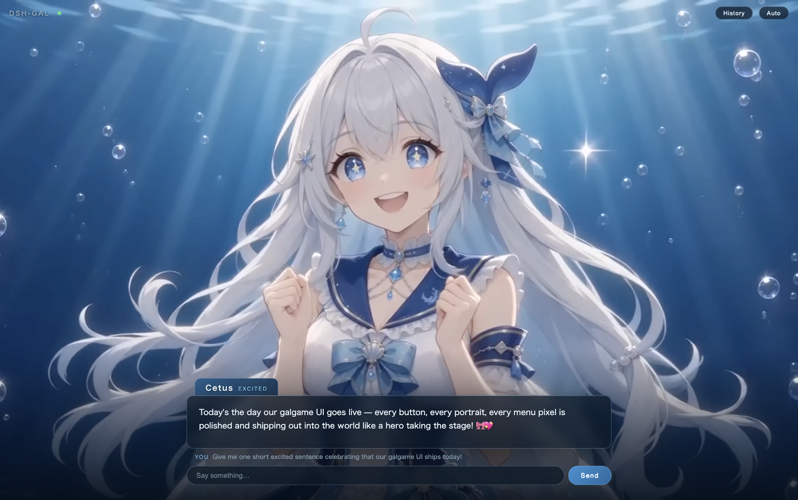
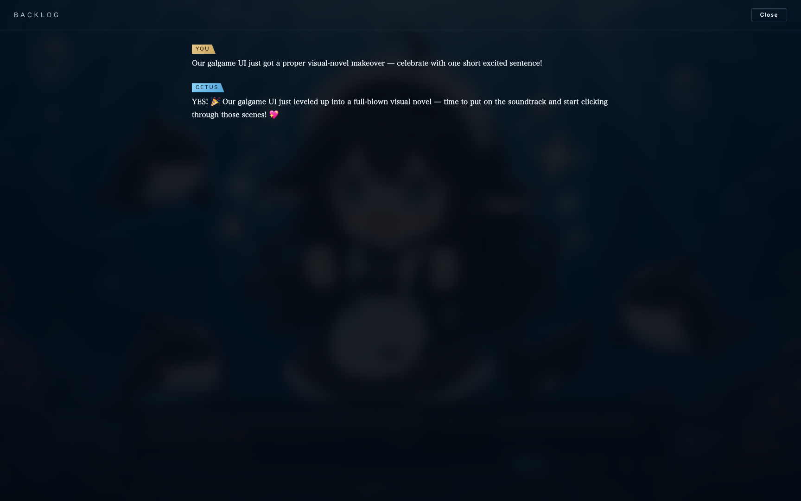

# dsh-gal

A galgame / visual-novel UI for the [DeepSeek Harness](https://github.com/deepseek-ai/deepseek-harness) (dsh), packaged as a dsh plugin.

Your agent becomes a whale girl. Each reply plays as a dialogue scene — typewriter text, one turn at a time, no scrolling wall of history — while she reacts with animated expressions chosen by an emotion judge. The backlog is one click away, just like a real visual novel.



## What it does

- **Scene-at-a-time dialogue** — only the latest exchange is on screen, rendered with a typewriter effect. Long replies page like VN text boxes (`click` / `Space` to advance, `Auto` mode available).
- **Animated whale girl** — six expressions (`neutral`, `happy`, `thinking`, `surprised`, `sad`, `excited`), each a looping micro-animation (Seedance 2.0 mini / MiniMax H3 image-to-video on fal.ai, from AI-generated base sprites); layers cross-fade on emotion change.
- **Emotion judge** — after each assistant turn, a tiny side LLM call classifies the reply's tone into one of the six expressions; a keyword heuristic covers fallback. While the agent works, she switches to `thinking` and a status ticker shows tool activity.
- **Backlog** — press `L` or click **History** for the full scrollable conversation log.

  
- **Drive the session from the UI** — the input box sends real user turns into the live dsh session.

## Install

```bash
git clone https://github.com/dsh-external/dsh-gal
cd dsh-gal && ./scripts/build.sh   # links against your dsh checkout and compiles src/ → lib/
```

Register it in `~/.dsh/cordis.patch.yml` (older builds: `~/.dsh/config.yaml`):

```yaml
- insert:
    - id: dsh-gal
      name: /absolute/path/to/dsh-gal/lib/index.js
      config:
        port: 4877          # UI at http://127.0.0.1:4877/
        characterName: Cetus
```

Start `dsh web` as usual and open `http://127.0.0.1:4877/`. If no session is open yet, the first message you send opens one on your default model — the novel is playable standalone.

## Configuration

| key | default | description |
| --- | --- | --- |
| `port` | `4877` | Listen port on 127.0.0.1 |
| `token` | `""` | Optional shared token appended to the URL |
| `characterName` | `Cetus` | Name shown on the dialogue nameplate |
| `judgeEnabled` | `true` | Use an LLM call to pick the expression (heuristic fallback otherwise) |
| `judgeTimeoutMs` | `4000` | Deadline for the emotion judge before falling back |

## Regenerating the art

The sprites and motion loops ship with the repo, but everything is reproducible:

- Base sprite + expression variants: any strong image model — generate one base portrait, then edit it per expression with the base as reference so the character stays consistent
- Micro-animations: `scripts/animate.sh <sprite.png> <out.mp4> "<motion prompt>" [h3]` — Seedance 2.0 mini image-to-video on fal.ai (`bytedance/seedance-2.0/mini/image-to-video`, 720p ≈ $0.15/s) by default, MiniMax H3 (`minimax/h3/image-to-video`, 768P) with the `h3` arg

## License

BSD-3-Clause
